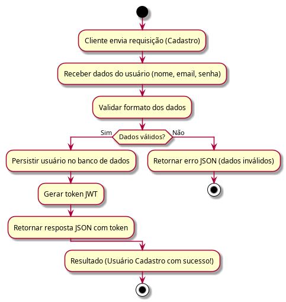
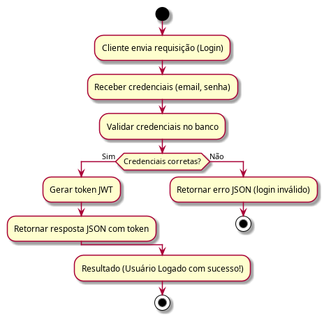
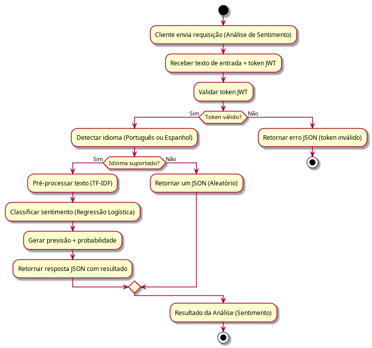

# Projeto: SentimentAPI — Análise de Sentimentos de Feedbacks


---

### **Índice**
- Descrição do Projeto
- Front-end
- Tecnologias Utilizadas
- Estrutura do Projeto
- Execução do Projeto
- Fluxogramas do Sistema
- Equipe

---

### 📝 **Descrição do Projeto**
API para classificação automática de sentimentos (Positivo/Negativo/Neutro) em feedbacks de clientes, utilizando um modelo de Machine Learning integrado a um backend Java Spring Boot.

### 🖥️ Front-end

O projeto já conta com um front-end funcional, responsável por permitir a interação do usuário com a API de análise de sentimentos.

Principais funcionalidades do front-end:

* Envio de feedbacks de clientes para análise

* Exibição do sentimento classificado (Positivo, Negativo ou Neutro)

* Integração direta com o backend Java via requisições HTTP

* Interface simples e focada na usabilidade

⚙️ O front-end consome a API REST do backend, que por sua vez se comunica com o serviço de Machine Learning em Python, completando o fluxo ponta a ponta da aplicação.

📌 Observação:
O código do front-end encontra-se em funcionamento e integrado ao backend. Documentação e melhorias visuais poderão ser adicionadas nas próximas iterações do projeto.

### ⚙️ **Tecnologias Utilizadas**
Seguindo a arquitetura de microserviços, adotaremos a seguinte stack:
  
**Backend:** 
* Java 17 + Spring Boot 3 - API /sentiment
* Spring Web (REST) - Endpoints
* OpenFeign - Cliente HTTP → Python
* H2 Database - Banco em memória
* Swagger/OpenAPI - Documentação

**Data Science:**
* Python + Pandas + Scikit-learn - Treinar modelo
* Joblib - Persistir modelo
* FastAPI - Servidor leve para predição
* Streamlit (opcional) - Visualização

**Infra/Dev:**
* Git / GitHub (Monorepo)
* Docker (futuro)

**Build/Deploy:**
* Oracle Cloud (futuro) 

### 📁 **Estrutura do Projeto**
* `/backend` - Código fonte da API Java
* `/data` - Notebooks e scripts de treinamento do modelo
* `/docs` - Documentação complementar
#### Visão Geral do Repositório
```
hackathon-sentimentapi-analytics
│
├── backend/                # Spring Boot (Java)
│   ├── src/...
│   └── pom.xml
│
├── data/                   # Python
│   ├── notebooks/          # Jupyter
│   ├── model/              # Modelo .joblib
│   ├── app.py              # FastAPI
│   └── requirements.txt
│
├── docs/                    # Documentação
└── README.md
```
---
### 🚀 Execução do Projeto
⚠️ **Importante:** o serviço Python **deve estar em execução antes** de iniciar o backend Java.

Este projeto é composto por dois serviços principais que devem ser executados separadamente:

- Serviço de Machine Learning (Python + FastAPI)
- API Backend (Java + Spring Boot)

⚠️ O backend Java depende do serviço Python estar em execução.

#### 🔹 Pré-requisitos

Certifique-se de ter instalado:

- Java 17+

- Maven 3.8+

- Python 3.10+

- Git

#### 🐍 1. Executando o Serviço de Machine Learning (Python)

Responsável por classificar o sentimento dos feedbacks.
```bash
cd data
```

Crie e ative um ambiente virtual (opcional, mas recomendado):
```bash
python -m venv venv
source venv/bin/activate   # Linux/Mac
venv\Scripts\activate      # Windows
```

Instale as dependências:
```bash
pip install -r requirements.txt
```

Execute a API FastAPI:
```bash
uvicorn app:app --reload
```

📍 O serviço estará disponível em:
👉 http://localhost:8000

📄 Documentação automática (Swagger):
👉 http://localhost:8000/docs


#### ☕ 2. Executando o Backend (Java + Spring Boot)

Responsável por expor a API REST e integrar com o serviço Python.
```bash
cd backend
```
Execute a aplicação:
```bash
mvn spring-boot:run

```
📍 A API estará disponível em:
👉 http://localhost:8080

📄 Documentação Swagger/OpenAPI:
👉 http://localhost:8080/swagger-ui.html

#### 🔁 Fluxo de Funcionamento

1. O cliente envia um feedback para a API Java

2. O backend chama o serviço Python via HTTP (OpenFeign)

3. O modelo de Machine Learning classifica o sentimento

4. O resultado é retornado e persistido no banco H2

#### 🛑 Encerrando a Aplicação

Para encerrar os serviços, utilize:
```bash
CTRL + C
```
em ambos os terminais (Python e Java).

---
### 📊 Fluxogramas do Sistema

Abaixo estão os fluxos principais da aplicação:

#### 🔐 Fluxo de Cadastro
Representa o processo de criação de um novo usuário no sistema. 


#### 🔑 Fluxo de Login
Representa o processo de autenticação de um usuário no sistema. 


#### 💬 Fluxo de Análise de Sentimento
Representa o processo de classificação automática de feedbacks em positivo, negativo ou neutro.


#### Visão Geral do Repositório
```
hackathon-sentimentapi-analytics
│
├── backend/                # Spring Boot (Java)
│   ├── src/...
│   └── pom.xml
│
├── data/                   # Python
│   ├── notebooks/          # Jupyter
│   ├── model/              # Modelo .joblib
│   ├── app.py              # FastAPI
│   └── requirements.txt
│
├── doc/                    # Documentação
└── README.md
```
---

### 👥 **Equipe do Projeto**
#### **Backend Team**
 [](https://github.com/amaro-netto)
[](https://github.com/MicheleLescano)
[](https://github.com/Rshinna)
#### **Data Team**
 [](https://github.com/brunorm86)
[]()

---
